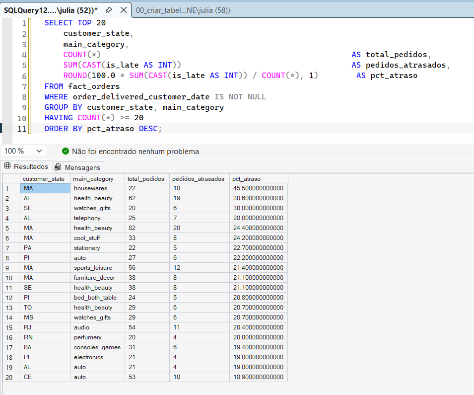
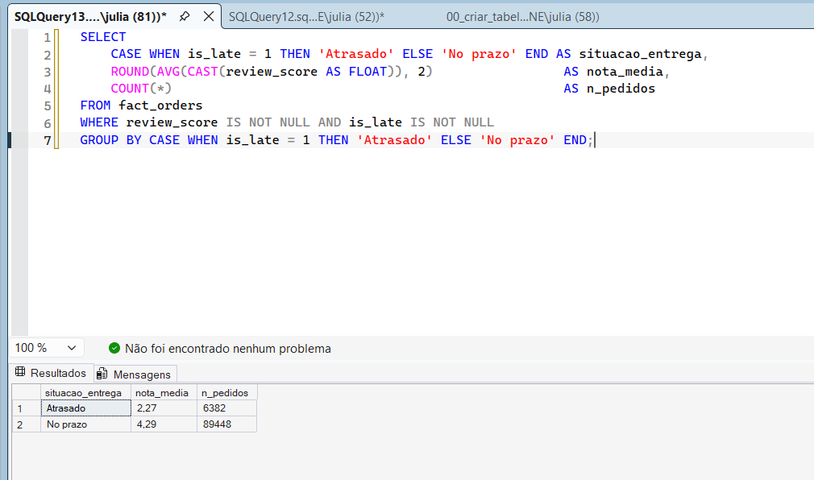
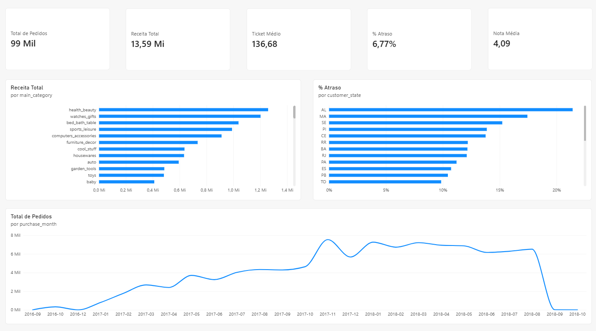
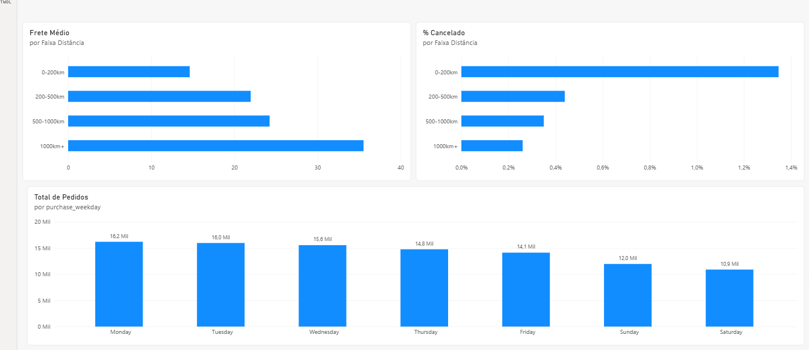

# Análise de Vendas e Logística — E-commerce Olist

Projeto de Business Intelligence construído a partir do [Brazilian E-Commerce Public Dataset by Olist](https://www.kaggle.com/datasets/olistbr/brazilian-ecommerce), com o objetivo de investigar padrões de vendas, atrasos de entrega e satisfação do cliente em um marketplace brasileiro, e transformar esses achados em um dashboard interativo.

## Contexto

A Olist é uma plataforma que conecta pequenos e médios lojistas brasileiros aos principais marketplaces do país. O dataset público reúne cerca de 100 mil pedidos feitos entre 2016 e 2018, com informações de pedido, pagamento, frete, avaliação do cliente, vendedor e localização geográfica.

Este projeto simula o trabalho de um(a) analista de BI que precisa entender **onde a operação está perdendo eficiência e satisfação do cliente**, e comunicar isso para áreas de negócio através de um dashboard.

## Perguntas de negócio

O projeto foi guiado pelas seguintes perguntas:

1. **Atraso de entrega**: qual o percentual de pedidos entregues após o prazo estimado, e como isso varia por região (estado) e por categoria de produto?
2. **Satisfação do cliente**: existe relação entre atraso na entrega e a nota de avaliação (review score) dada pelo cliente?
3. **Sazonalidade**: como o volume de vendas e o ticket médio variam ao longo dos meses/dias da semana? Existem picos que a operação deveria se preparar melhor para atender?
4. **Categorias e regiões mais relevantes**: quais categorias de produto e quais estados geram mais receita, e quais têm a pior relação entre receita e satisfação/atraso?
5. **Frete**: qual a relação entre o valor do frete e a distância entre vendedor e cliente, e isso impacta a decisão de compra (cancelamentos)?

> Ajuste esta lista conforme os achados forem aparecendo — no BI é normal a análise revelar novas perguntas pelo caminho.

## Fonte de dados

- **Dataset**: [Brazilian E-Commerce Public Dataset by Olist](https://www.kaggle.com/datasets/olistbr/brazilian-ecommerce) (Kaggle, dados públicos, licença CC BY-NC-SA 4.0)
- Baixe os arquivos `.csv` e coloque em `data/raw/` (essa pasta é ignorada pelo git — veja `.gitignore`)

## Ferramentas utilizadas

- **SQL Server** (T-SQL) — modelagem e consultas, via SQL Server Express + SSMS
- **Python** (pandas) — limpeza, tratamento e enriquecimento dos dados
- **Power BI** — modelagem semântica (DAX) e dashboard final

## Estrutura do repositório

```
projeto-olist-bi/
├── data/
│   ├── raw/            # dados originais baixados do Kaggle (não versionados)
│   └── processed/      # dados já tratados, prontos para o Power BI
├── sql/                # scripts de criação de tabelas e queries de análise
├── notebooks/          # notebooks/scripts Python de limpeza e exploração
├── dashboard/          # arquivo .pbix e/ou exports (PDF, imagens) do dashboard
├── docs/               # prints e material de apoio para o README
└── README.md
```

## Como reproduzir

1. Baixe o dataset no Kaggle e extraia os `.csv` para `data/raw/`.
2. Rode `python notebooks/clean_and_load.py` para limpar e tratar os dados (gera `data/processed/fact_orders.csv` e `data/processed/dim_products.csv`).
3. No SQL Server Management Studio (SSMS), crie um banco chamado `olist_bi` e rode o script `sql/00_criar_tabelas_e_importar.sql` (cria as tabelas com os tipos corretos e importa os CSVs via `BULK INSERT` — mais confiável do que o assistente gráfico de importação, que tem bugs de conversão decimal).
4. Rode as queries em `sql/01` a `sql/05` (T-SQL) direto no SSMS para explorar as respostas às perguntas de negócio.
5. Abra `dashboard/projeto-olist.pbix` no Power BI Desktop, conecte na fonte SQL Server (`localhost\SQLEXPRESS`, banco `olist_bi`) e atualize o modelo.

## Principais insights

- **Atraso é o maior destruidor de satisfação**: pedidos entregues com atraso têm nota média de avaliação de **2.27**, contra **4.29** dos pedidos entregues no prazo — de longe o fator com maior impacto na experiência do cliente.
- **Atraso concentrado geograficamente**: estados do Nordeste, como Maranhão e Alagoas, apresentam as maiores taxas de atraso por categoria de produto (até ~45% dos pedidos), provavelmente por ficarem mais distantes dos centros de distribuição concentrados no Sudeste.
- **Categorias que mais geram receita**: saúde/beleza, relógios/presentes e cama/mesa/banho lideram o faturamento total no período analisado.
- **Frete sobe com a distância, mas cancelamento cai**: o valor médio do frete cresce de ~R$14 (até 200km) para ~R$35 (acima de 1.000km), como esperado — mas a taxa de cancelamento na verdade *diminui* com a distância (de 0,76% para 0,26%), o oposto do que a intuição sugeriria. Vale investigar se isso se explica pelo perfil de produto comprado a longa distância.
- **Sazonalidade**: o volume de vendas cresce de forma consistente ao longo dos meses do período analisado, com segundas-feiras concentrando o maior número de pedidos e finais de semana os menores.

_(dados extraídos das queries em `sql/`, rodadas no SQL Server via SSMS sobre as tabelas geradas por `notebooks/clean_and_load.py` + `sql/00_criar_tabelas_e_importar.sql`)_





## Dashboard

O dashboard final tem 2 páginas no Power BI (`dashboard/projeto-olist.pbix`):

**Visão Geral** — KPIs principais, receita por categoria, % de atraso por estado e evolução mensal de pedidos.



**Logística e Frete** — frete médio e % de cancelamento por faixa de distância (mostrando o achado contraintuitivo: frete sobe, cancelamento cai), e pedidos por dia da semana.



> Nota: a queda brusca de pedidos em set/out de 2018 no gráfico de evolução mensal não reflete uma queda real de vendas — é uma limitação conhecida do dataset público da Olist, cuja coleta de dados é bem esparsa a partir de agosto/2018.

## Autora

Juliane Tolino — Analista de Business Intelligence
[LinkedIn](#) · [GitHub](#)
